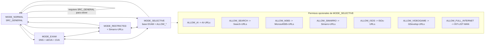

# MikroTik VLAN Modes App - Tkinter

La aplicación permite cambiar la pertenencia de una IP o subred configurada a
las listas de origen (`address-list`) que usan las reglas `forward` del
firewall, para moverla entre `MODE_NORMAL`, `MODE_EXAM`, `MODE_RESTRICTED` y
`MODE_SELECTIVE`.

La aplicación **no crea ni modifica reglas de firewall, listas de destino, la
configuración DNS ni los permisos del router**. Únicamente añade o retira la
red gestionada de listas de origen ya existentes (`MODE_EXAM`,
`MODE_RESTRICTED`, `MODE_SELECTIVE`, las listas `ALLOW_*` y, para
comprobarlo, `SRC_GENERAL`). Este documento describe el comportamiento de la
aplicación; **no se ha validado contra las reglas reales del router**, que
deben revisarse por separado en el MikroTik.

## Versión 1.4.0

- **Opciones `ALLOW_*` dinámicas**: `MODE_SELECTIVE` detecta las opciones a
  partir de las reglas activas `forward` con acción `accept`; añadir una regla
  compatible en MikroTik ya no requiere editar ni recompilar la aplicación.
- **Limpieza de permisos residuales**: al cambiar de modo se retiran de la red
  gestionada las membresías `ALLOW_*` huérfanas, incluso si su regla ya se
  eliminó. `ALLOW_MICROSOFT` sigue excluida por ser un nombre heredado.

### Cambios de la versión 1.3.1

Esta versión corrige el orden de las transiciones entre modos y refuerza la
verificación de los cambios, sin tocar la política de firewall acordada.

- **Transiciones protegidas**: al cambiar de modo, la aplicación ya no borra
  primero el modo anterior y crea después el nuevo. Ahora se añade primero el
  modo/las listas de destino (usando `MODE_EXAM` como protección puente
  cuando la red partía de `MODE_NORMAL`), se verifica releyendo el router y
  solo entonces se retiran las restricciones sobrantes. Así se evita el
  intervalo en el que una VLAN podía quedar temporalmente bajo la política de
  `MODE_NORMAL` durante un cambio entre modos especiales, y se evita que un
  fallo a mitad de camino deje la red sin ninguna restricción.
- **Requisito para `MODE_NORMAL`**: antes de retirar la última restricción se
  comprueba que la red pertenece a `SRC_GENERAL`. Si no se cumple, se aborta
  sin modificar ninguna entrada. La aplicación nunca añade ni retira `SRC_GENERAL`.
- **`MODE_SELECTIVE`**: al aplicar una nueva selección de permisos opcionales,
  primero se retiran los que ya no están seleccionados y después se añaden los
  nuevos, para no ampliar el acceso antes de haber reducido el anterior.
- **Validación de argumentos antes de cualquier escritura**: en `MODE_SELECTIVE`,
  una lista `ALLOW_*` no reconocida se rechaza antes de leer o modificar
  ninguna entrada (incluido el puente `MODE_EXAM`), no después.
- **Casillas `ALLOW_*` verificadas de nuevo**: cada clic vuelve a comprobar que
  el modo sigue siendo `MODE_SELECTIVE`, aplica el cambio, relee el router y
  sincroniza la casilla con lo verificado (no con lo solicitado), también
  cuando hay un error. Si el estado verificado no coincide con lo pedido (por
  ejemplo, otra fuente readd o retira la entrada mientras tanto), se conserva
  el estado realmente leído y se informa explícitamente de que la operación
  solicitada no se ha conseguido, en vez de darla por buena en silencio.
- **Reintentos seguros ante timeouts**: al dar de alta una entrada, si se
  pierde la respuesta de una escritura (error de conexión), la aplicación
  relee antes de decidir si repetirla, para no crear una entrada duplicada por
  un simple timeout cuando el router sí la había aplicado.
- **Recuperación de estado tras error más robusta**: si tras un fallo la
  relectura de verificación también falla (por pérdida de conexión o por un
  error HTTP como 403), se muestra igualmente "estado no verificado" y se
  deshabilitan las casillas, en vez de dejar visible un estado antiguo.
- **Limpieza de conntrack tras un cambio efectivo**: solo se limpia cuando el
  permiso realmente cambió (especialmente al revocarlo) y nunca cuando no
  hubo ningún cambio. Un fallo de conntrack se informa por separado del
  resultado del cambio de listas: no se revierte la lista ni se anuncia un
  corte de tráfico que no se ha podido confirmar. Ver la nota sobre conexiones
  ya establecidas más abajo.
- **Estado no verificado**: si se pierde la conexión con el router antes de
  poder confirmar el resultado de una operación, la aplicación no afirma
  éxito ni rollback; muestra el estado como no verificado.
- **Bloqueo de operaciones simultáneas**: esta instancia impide lanzar dos
  operaciones de escritura a la vez (cambio de modo o casilla `ALLOW_*`);
  los botones y casillas se bloquean mientras se ejecuta la operación en
  segundo plano. Este bloqueo es solo local: no impide cambios simultáneos
  desde otra instancia de la aplicación o desde WinBox.
- **Listas heredadas**: la aplicación **no** detecta ni gestiona
  `ALLOW_MICROSOFT` (nombre anterior a `ALLOW_M365`) desde la interfaz; no
  hay migración ni borrado automático. Ver "Mantenimiento: listas heredadas"
  más abajo para la comprobación manual.
- Corrección de la documentación de `MODE_RESTRICTED`: ya no incluye
  Microsoft 365, IA ni buscadores (ver tabla más abajo).

## Política de firewall gestionada por la aplicación

La aplicación gestiona **solo pertenencia a listas de origen** usadas por las
reglas `forward`. El acceso al propio CCR (`10.99.0.1`) se regula por reglas
`input` independientes, fuera del alcance de esta aplicación.

| Modo | Listas de destino permitidas (además de las ya establecidas) | Resto del tráfico |
| --- | --- | --- |
| `MODE_EXAM` | DNS Conselleria (UDP/TCP 53), `idGVA-URLs`, `GVA-URLs` | `DROP` |
| `MODE_RESTRICTED` | DNS Conselleria (UDP/TCP 53), `idGVA-URLs`, `GVA-URLs`, `Simarro-URLs` | `DROP` |
| `MODE_SELECTIVE` | Base de `MODE_EXAM` más las opciones `ALLOW_*` seleccionadas | `DROP` |
| `MODE_NORMAL` | Política existente de `SRC_GENERAL`: Proxmox, red de servicios e Internet | Bloqueo de otras LAN internas según las reglas existentes |

Las opciones selectivas se descubren en las reglas activas de `forward` con
acción `accept` cuyo `src-address-list` siga el patrón `ALLOW_<nombre>` (solo
letras ASCII, números, `_` y `-` después del prefijo). Para añadir una opción,
crea su lista de origen y su regla compatible en el firewall; aparecerá al
actualizar la app, sin cambiar ni recompilar su código. Se reserva el prefijo
`ALLOW_` para estas opciones; al cambiar de modo también se limpian las
membresías de ese patrón que queden huérfanas, para evitar permisos residuales.
`ALLOW_MICROSOFT` continúa excluida por ser un nombre heredado.

### Añadir una opción nueva en MikroTik

1. Elige un nombre único, por ejemplo `ALLOW_NUEVO_SERVICIO`. Se admiten
  letras ASCII, números, `_` y `-` después de `ALLOW_`; no uses el nombre
  heredado `ALLOW_MICROSOFT`.
2. En **IP > Firewall > Filter Rules**, crea una regla habilitada con
  `chain=forward`, `action=accept` y `src-address-list=ALLOW_NUEVO_SERVICIO`.
  Añade también la condición que limita el destino autorizado, por ejemplo
  `dst-address-list=SERVICIO-URLs` o, para salida general a Internet,
  `out-interface-list=WAN`.
3. Coloca la regla en el punto correcto de la política: después de las reglas
  para conexiones `established,related` y antes de la regla `DROP` que la
  bloquearía. Comprueba que la regla no permite destinos más amplios de los
  previstos.
4. Pulsa **Actualizar estado** en la app. La nueva casilla aparecerá en
  `MODE_SELECTIVE`; al activarla, la app añadirá la red gestionada a esa
  `address-list`.

La app detecta el nombre y los campos `chain`, `action` y `disabled`, pero no
valida las condiciones de destino ni el orden de la regla. No añadas una regla
`accept` sin restricciones de destino únicamente para que aparezca la opción:
la política efectiva depende de la configuración completa del firewall.

Opciones selectivas configuradas actualmente:

| Lista de origen | Destino |
| --- | --- |
| `ALLOW_AI` | `AI-URLs` |
| `ALLOW_SEARCH` | `Search-URLs` |
| `ALLOW_M365` | `Microsoft365-URLs` |
| `ALLOW_SIMARRO` | `Simarro-URLs` |
| `ALLOW_ISOS` | `ISOs-URLs` |
| `ALLOW_VIDEOGAME` | `GDevelop-URLs` |
| `ALLOW_FULL_INTERNET` | Salida `INT-LIST-WAN` |

`ALLOW_FULL_INTERNET` solo habilita la salida general por WAN
(`INT-LIST-WAN`); no concede acceso general a otras redes internas ni
sustituye las reglas que bloquean el tráfico hacia otras LAN.

La aplicación nunca añade ni retira entradas de `SRC_GENERAL`: solo comprueba
su pertenencia como requisito antes de permitir la vuelta a `MODE_NORMAL`.

### Flujo de modos



Primero se entra en `MODE_SELECTIVE` (pulsando "Pasar a MODE_SELECTIVE", con
o sin opciones ya marcadas) y **después** se activan o desactivan las
casillas `ALLOW_*` de una en una; las casillas solo están habilitadas
mientras la VLAN sigue en `MODE_SELECTIVE`.

Las reglas base de cada modo las proporciona la configuración del firewall.
La aplicación solo añade o elimina la red gestionada de las listas
`MODE_EXAM`, `MODE_RESTRICTED`, `MODE_SELECTIVE` y `ALLOW_*`.

## Funcionamiento de los modos

Las reglas `forward` de MikroTik consultan la lista de direcciones a la que
pertenece la red gestionada. En todos los modos se aceptan primero las
conexiones ya establecidas o relacionadas antes de evaluar el modo o las
listas `ALLOW_*`; por eso, si ya había sesiones abiertas antes del cambio de
modo, las listas por sí solas **no garantizan** el corte inmediato de esas
sesiones existentes. La aplicación intenta limpiar esas conexiones
(`conntrack`) como paso adicional, best-effort, tras cada cambio de modo y
tras cada cambio efectivo de una casilla `ALLOW_*` (ver más abajo).

El acceso al propio CCR (`10.99.0.1`) se rige por reglas `input`
independientes de estos modos (que afectan al tráfico `forward`) y no se
modifica desde esta aplicación.

### `MODE_EXAM`

La red pertenece a `MODE_EXAM`. Se permiten los servicios necesarios para el
entorno de examen:

- DNS de Conselleria por UDP y TCP en el puerto 53.
- `idGVA-URLs`.
- `GVA-URLs`.

El resto del tráfico se descarta (`DROP`).

### `MODE_RESTRICTED`

La red pertenece a `MODE_RESTRICTED`. Mantiene los permisos base de examen y
añade el destino definido para el modo restringido:

- DNS de Conselleria por UDP y TCP en el puerto 53.
- `idGVA-URLs`.
- `GVA-URLs`.
- `Simarro-URLs`.

`MODE_RESTRICTED` **no** incluye Microsoft 365, servicios de IA ni
buscadores; esos destinos solo están disponibles como permisos opcionales de
`MODE_SELECTIVE`. El resto del tráfico se descarta (`DROP`).

### `MODE_SELECTIVE`

La red pertenece a `MODE_SELECTIVE` y recibe la misma base que `MODE_EXAM`:

- DNS de Conselleria por UDP y TCP en el puerto 53.
- `idGVA-URLs`.
- `GVA-URLs`.

Desde la aplicación se pueden seleccionar permisos adicionales mediante las
listas `ALLOW_*` del catálogo de la tabla anterior. Cada lista seleccionada
recibe la red gestionada como una entrada y amplía los destinos permitidos
por las reglas del firewall. El resto del tráfico se descarta (`DROP`).

### `MODE_NORMAL`

La red deja de pertenecer a `MODE_EXAM`, `MODE_RESTRICTED` y
`MODE_SELECTIVE`, y también se eliminan sus entradas de las listas `ALLOW_*`.
Antes de hacerlo, la aplicación comprueba que la red ya pertenece a
`SRC_GENERAL`; si no es así, aborta sin modificar nada. Vuelve al
comportamiento normal basado en `SRC_GENERAL`, con acceso a los servicios
habituales como Proxmox, Red Servicios e Internet. El tráfico hacia otras
redes internas que no esté permitido se bloquea (`DROP`) según las reglas ya
existentes.

## Transiciones protegidas entre modos

Las peticiones a la REST API de RouterOS **no forman una transacción
atómica**: cada alta o baja de una entrada de `address-list` es una llamada
HTTP independiente que puede fallar por separado. Para minimizar el riesgo de
dejar la red sin restricción o con permisos ampliados por accidente, la
aplicación sigue este orden:

1. Antes de modificar nada, se lee el estado inicial. Si la red ya pertenece
   a más de un modo especial a la vez, se trata como un **conflicto
   encontrado al iniciar la operación** (por ejemplo, tras una edición manual
   en WinBox) y se aborta sin tocar ninguna entrada.
2. Si la red partía de `MODE_NORMAL` (sin ninguna restricción activa), se
   añade `MODE_EXAM` como protección puente antes de cualquier otro cambio.
3. Se añade el modo de destino (y, en `MODE_SELECTIVE`, se reconcilian antes
   las listas `ALLOW_*`: primero se retiran las no seleccionadas y después se
   añaden las nuevas, para no ampliar el acceso antes de reducirlo).
4. Se relee el router para confirmar que el destino está activo. Si no se
   puede confirmar -incluida la pérdida de conexión-, se aborta sin retirar
   la restricción anterior ni el puente.
5. Solo entonces se retiran las restricciones sobrantes (el modo anterior y,
   si se usó, el puente `MODE_EXAM`).

Esto puede hacer que, durante un instante, la red pertenezca a dos modos
especiales a la vez (el anterior/puente y el nuevo). Eso es un **estado
transitorio controlado** por la propia transición, distinto del conflicto
detectado en el paso 1: nunca implica ausencia de restricción ni una
ampliación de permisos.

Para volver a `MODE_NORMAL` el orden es el inverso en cuanto a permisos: se
comprueba primero el requisito de `SRC_GENERAL`, se limpian los permisos
opcionales y, al final, se retira la última restricción activa.

Si una escritura falla a mitad de la transición, la aplicación no intenta una
recuperación automática que amplíe permisos: conserva la restricción
conocida (la anterior, el puente, o ambas si ya se había añadido el destino)
y comunica en el registro y en pantalla el estado observado. Si se pierde la
conexión antes de poder verificar el resultado, se muestra "estado no
verificado" y no se afirma éxito ni rollback.

## Mantenimiento: listas heredadas (`ALLOW_MICROSOFT`)

El catálogo actual usa `ALLOW_M365`. La aplicación (interfaz Tkinter) **no**
comprueba ni gestiona el nombre heredado `ALLOW_MICROSOFT`: no hay detección
en pantalla, ni migración, ni borrado automático desde ningún botón.

Si el router conserva entradas antiguas con ese nombre para la red
gestionada, la comprobación y limpieza es una tarea de **mantenimiento
manual**, fuera de la interfaz de esta aplicación:

- Revisar `/ip firewall address-list` en WinBox o por REST, filtrando por
  `list=ALLOW_MICROSOFT` y la red gestionada.
- Si procede eliminarlas, hacerlo explícitamente y solo para esa red y ese
  nombre heredado; no convertir automáticamente el permiso antiguo en
  `ALLOW_M365` (revisar antes si esa red debe seguir teniendo ese permiso) ni
  borrar otras listas `ALLOW_*` ni entradas de otras redes.

`mikrotik_api.MikroTikRestClient` expone `get_legacy_allow_entries()` y
`remove_legacy_allow_entries()` como utilidades de bajo nivel para scripts de
mantenimiento puntuales; no se invocan automáticamente desde la aplicación.

## Concurrencia y bloqueo de operaciones

Cada instancia de la aplicación impide lanzar una segunda operación de
escritura (cambio de modo o casilla `ALLOW_*`) mientras otra sigue en curso:
los botones y casillas se deshabilitan durante la operación en segundo plano
y las actualizaciones de la interfaz siempre se aplican en el hilo principal
de Tkinter. Este bloqueo es **solo local a la instancia**: no impide que otra
instancia de la aplicación, u otro operador desde WinBox, modifiquen las
mismas listas al mismo tiempo. Tras un error se intenta recuperar el estado
real del router; si tampoco se puede leer, se muestra como desconocido y las
casillas dejan de presentarse como confirmadas hasta la siguiente lectura
correcta.

Versión sin Qt/PySide6, pensada para servidores Ubuntu antiguos donde Qt falla por CPU sin SSSE3/SSE4.

## Instalación en Ubuntu

### 1. Instalar Python y Tkinter

Ejecuta estos comandos con un usuario que tenga permisos `sudo`:

```bash
sudo apt update
sudo apt install -y python3 python3-venv python3-pip python3-tk unzip git
```

### 2. Obtener la aplicación

Elige una de estas dos opciones.

Desde GitHub:

```bash
sudo mkdir -p /opt/firewall-app
sudo chown "$USER":"$USER" /opt/firewall-app
cd /opt/firewall-app
git clone https://github.com/alapvi/firewall-app.git mikrotik_vlan_modes_tk_app
cd mikrotik_vlan_modes_tk_app
```

Desde un archivo ZIP:

```bash
mkdir -p /opt/firewall-app
cd /opt/firewall-app
unzip mikrotik_vlan_modes_tk_app.zip
cd mikrotik_vlan_modes_tk_app
```

### 3. Crear el entorno virtual

El entorno virtual mantiene las dependencias aisladas del Python del sistema:

```bash
python3 -m venv .venv
source .venv/bin/activate
```

El prompt del terminal mostrará normalmente `(.venv)` mientras esté activo.

### 4. Instalar las dependencias

Con el entorno virtual activo:

```bash
python -m pip install --upgrade pip
python -m pip install -r requirements.txt
```

Para ejecutar las pruebas automatizadas (no necesarias para usar la app) se
usa además `pytest`, listado en `requirements-dev.txt`.

### 5. Comprobar los requisitos de MikroTik

Antes de ejecutar la aplicación, confirma que en el CCR están disponibles:

- `www-ssl` activo en el puerto `7443`.
- Reglas `input` permitiendo `SRC_TODAS_LAN -> 10.99.0.1:7443` (acceso al
  propio CCR, independiente de los modos `forward` descritos arriba).
- Un usuario con permisos para leer `/ip firewall filter`, modificar
  `/ip firewall address-list` y limpiar `/ip firewall connection`.
- Las listas `MODE_EXAM`, `MODE_RESTRICTED`, `MODE_SELECTIVE`, `ALLOW_*` y
	`SRC_GENERAL` usadas por las reglas `forward` del firewall, con la
	semántica descrita en la tabla y el diagrama anteriores.

La aplicación detecta las reglas `forward accept` de origen `ALLOW_*`, pero no
valida el destino ni la política completa que implementan: esa semántica debe
revisarse en el MikroTik. La app solo gestiona la pertenencia a las listas.

### 6. Configurar la VLAN

El script `modo_salo.sh` ya viene preparado para la VLAN 21, red
`10.0.21.0/24` y nombre `Saló de Actes`:

```bash
./modo_salo.sh
```

Si la VLAN es diferente, edita ese script o ejecuta la aplicación manualmente:

```bash
source .venv/bin/activate
python app.py --host 10.99.0.1 --port 7443 --user firewall-app \
	--vlan 21 --network 10.0.21.0/24 --name "Saló de Actes"
```

La aplicación solicitará la contraseña de MikroTik en una ventana, no desde la
línea de comandos.

### 6.1. Ejecutar desde un servidor sin escritorio

La aplicación utiliza Tkinter y necesita una pantalla gráfica. Si el servidor
se administra por SSH y `echo "$DISPLAY"` no muestra ningún valor, no se puede
abrir la ventana directamente en esa terminal.

Opciones recomendadas:

- Ejecutar la aplicación en un ordenador con escritorio gráfico y conectarlo al
	MikroTik usando la IP y el puerto configurados.
- Usar SSH con reenvío X11 desde un equipo Linux o macOS:

	```bash
	ssh -X usuario@servidor
	cd /opt/firewall-app/mikrotik_vlan_modes_tk_app
	source .venv/bin/activate
	./modo_salo.sh
	```

	El equipo cliente debe tener un servidor X instalado y el servidor SSH debe
	permitir `X11Forwarding`.
- Usar un escritorio remoto o VNC en el servidor.

Un display virtual como `Xvfb` solo sirve para ejecutar la aplicación sin verla;
no es útil para manejar esta interfaz de forma interactiva.

### 7. Seleccionar `MODE_SELECTIVE`

Pulsa **Actualizar estado** para consultar las siete listas `ALLOW_*`
disponibles. Pulsa **Pasar a MODE_SELECTIVE** (con o sin casillas marcadas)
para entrar en el modo; una vez dentro, marca o desmarca las casillas
`ALLOW_*` una a una para activar o revocar cada permiso al instante, sin
tener que volver a pulsar el botón de modo.

Para salir del modo selectivo, cambia a `MODE_EXAM`, `MODE_RESTRICTED` o
`MODE_NORMAL`. Las entradas `ALLOW_*` de esa VLAN se eliminarán al cambiar de
modo.

## Requisitos en MikroTik

- `www-ssl` activo en puerto 7443.
- Reglas `input` permitiendo `SRC_TODAS_LAN -> 10.99.0.1:7443` (acceso al
  propio CCR; no se confunde con los perfiles `forward` de los modos).
- Usuario con permisos suficientes para modificar `/ip firewall address-list` y limpiar `/ip firewall connection`.
- Las listas `MODE_EXAM`, `MODE_RESTRICTED`, `MODE_SELECTIVE`, `ALLOW_*` y
	`SRC_GENERAL` deben existir en las reglas del firewall con la semántica
	mostrada en la tabla y el diagrama. Esta aplicación no verifica ni valida
	esas reglas: solo gestiona la pertenencia a las listas.

## Pruebas automatizadas

Las pruebas usan un backend REST simulado en memoria (`tests/fake_backend.py`)
y no requieren conexión a ningún router:

```bash
python3 -m pip install -r requirements-dev.txt
python3 -m pytest
```

Cobertura actual:

- Estado final correcto de las 16 combinaciones entre los cuatro modos.
- Ausencia de intervalos sin restricción activa al transitar entre modos
  especiales.
- Rechazo previo de `MODE_NORMAL` cuando no se cumple el requisito de
  `SRC_GENERAL`, y comprobación de que la app nunca toca esa lista.
- Fallos de lectura, alta y eliminación en puntos relevantes de las
  transiciones (incluida la pérdida de conexión durante la verificación).
- Activación y revocación de casillas `ALLOW_*`, verificación posterior y
  limpieza de conntrack solo tras un cambio efectivo.
- Fallo de conntrack diferenciado del resultado del cambio de listas.
- Detección y limpieza de listas heredadas a nivel de `mikrotik_api.py`
  (utilidad de mantenimiento, sin conversión automática y limitada a la red
  gestionada); no forma parte de la interfaz de la aplicación.
- Bloqueo de operaciones simultáneas sobre la misma instancia.

Limitaciones conocidas de esta batería de pruebas (pendientes de validar
contra un MikroTik real):

- No comprueba que las reglas `forward`/`input` reales del router tengan la
  semántica descrita en este documento.
- No cubre la interacción completa de la interfaz Tkinter (se probó la
  lógica de `mikrotik_api.py` y `vlan_controller.py`, que no dependen de un
  display gráfico); en este entorno de desarrollo no había un servidor X
  disponible para instanciar la ventana real.
- No reproduce condiciones de red reales (latencia, particiones, reintentos
  de RouterOS) más allá de los fallos inyectados manualmente.
- No cubre el comportamiento cuando dos instancias distintas, o WinBox,
  modifican las mismas listas al mismo tiempo: el bloqueo implementado es
  solo local a cada instancia.

## Historial de versiones

### 1.3.1

Transiciones protegidas entre modos (se añade el destino y se verifica antes
de retirar la restricción anterior), validación de las listas `ALLOW_*`
solicitadas antes de cualquier escritura, comprobación de `SRC_GENERAL` antes
de volver a `MODE_NORMAL`, reconciliación segura de las listas `ALLOW_*` en
`MODE_SELECTIVE`, verificación y sincronización de las casillas tras cada
cambio -incluidos los errores y el caso en que el estado verificado no
coincide con lo solicitado-, reintentos seguros ante timeouts en altas de
`address-list` (releyendo antes de repetir, para no duplicar entradas),
recuperación de estado tras error que también cubre fallos HTTP (no solo
pérdida de conexión), limpieza de conntrack solo tras un cambio efectivo y
diferenciada de un fallo propio, bloqueo de operaciones simultáneas por
instancia, corrección de la documentación de `MODE_RESTRICTED`, y pruebas
automatizadas con un backend REST simulado. La interfaz mantiene únicamente
los controles de modo y las siete casillas `ALLOW_*`; la comprobación de
listas heredadas (`ALLOW_MICROSOFT`) queda documentada como tarea manual de
mantenimiento (ver "Mantenimiento: listas heredadas"), sin botón, migración
ni borrado automático en la aplicación.

### 1.3.0

Los permisos `ALLOW_*` se activan o desactivan al instante mientras la VLAN
está en `MODE_SELECTIVE` y quedan deshabilitados en el resto de modos. La
ventana se adapta al tamaño de la pantalla y todos los cambios de modo piden
confirmación antes de aplicarse.

### 1.2.0

`get_vlan_mode` verifica `SRC_GENERAL` en una sola consulta REST, las listas
`ALLOW_*` pasan a un catálogo fijo, los identificadores `.id` de RouterOS ya
no codifican el `*`, y la limpieza de `conntrack` se trata como una acción
best-effort independiente del cambio de modo.

### 1.1.3

Guía de instalación ampliada con pasos para obtener el código, crear el
entorno virtual, instalar dependencias, configurar la VLAN y ejecutar la
aplicación.

### 1.1.0

Primera versión con `MODE_SELECTIVE`, selección dinámica de listas `ALLOW_*`
y sincronización de los permisos activos desde MikroTik.
